## Summary
For the fictionalized Shirabuki Corporation, I decided to create distinct users, groups and personas for the project. I could have easily created an administrator account and worked with Azure in that regard, but this would severely limit the usefulness and design of the project, which was to practically apply Principle of Least Privilege and Role Based Access Control within a free and safe environment. This was an important distinction as I wanted to closely emulate real-world enterprise environments without overcomplicating my understanding of the concepts at play.

## The Problem
Shirabuki Corporation currently has two administrators, three employees, and one contractor from a third party company. Shirabuki Corporation wants each user to be grouped by their role, and have access controls to the resource group per their role assignment. Regarding password management, every user, no matter if they are an administrator, employee, or contractor, will need to do a password reset upon the first login attempt.

## What Was Built
- Resource Group
   - Shirabuki_Corporation
- Users
   - Two administrator accounts (Shirabuki Admin 1 and Shirabuki Admin 2)
   - Three employee accounts (Shirabuki Employee 1, Shirabuki Employee 2, Shirabuki Employee 3)
   - One external contractor account (Shirabuki Contractor)
- Security Groups
   - sg-shirabuki-admins
   - sg-shirabuki-employees
   - sg-shirabuki-contractors
- Roles
   - Scoped within 02.RBAC_Roles/README.md

## Decisions Made
   - Ownership Decisions

      The group "sg-shirabuki-admins" is owned by the root tenant account, in this case, my personal account. I had initially wanted the administrators to own their own security group, but upon closer scrutinization, I realized this would lead to a recursive path of ownership. Both the employees and contractors security groups are jointly owned by Admins 1 and 2. While working on this section, I wanted the admin security group to own the employee and contractors group, but this couldn't be done due to limitations of EntraID, but also, a user should own a different group, as having a whole group owning another could lead to non-separated duties, leading to issues with accountability and auditability for which admin performed which action.

   - External Contractor Decisions

      To tie the contractor role closer to production level environments, I used a spare email account to act as the third party contractor to be invited. I noted that guest users can belong to groups in the same way member accounts can, and specifically bringing an external user as a contractor/vendor can reflect how enterprise organizations distinguish the access of employees versus third parties. This includes separate governance measures, and in a production environment with P2 licensing, automatic access expiration tied to contract duration.

      - Sign in behavior specific to the External Contractor/Guest Account is further documented within [Scenario 3: Access_Verification](03.Access_Verification/README.md)

   - Password Governance Standards

       Upon review of each user created, I noted that each user had "Force change password next sign-in" enabled. To see if this functionality was enabled by default, I went through the "Create New User" flow and found that "Auto-generate password" was checked automatically.
       The idea behind this was to ensure that owners and administrators should not continue to have access to employee or contractor passwords. By enabling a forced reset when first signing into their accounts, this ensures that only the account holder knows their working credentials, rather than an administrator still having access via the initial password.
       Shirabuki Employee 1 was used for demonstration purposes.

## Screenshots
- Users List 
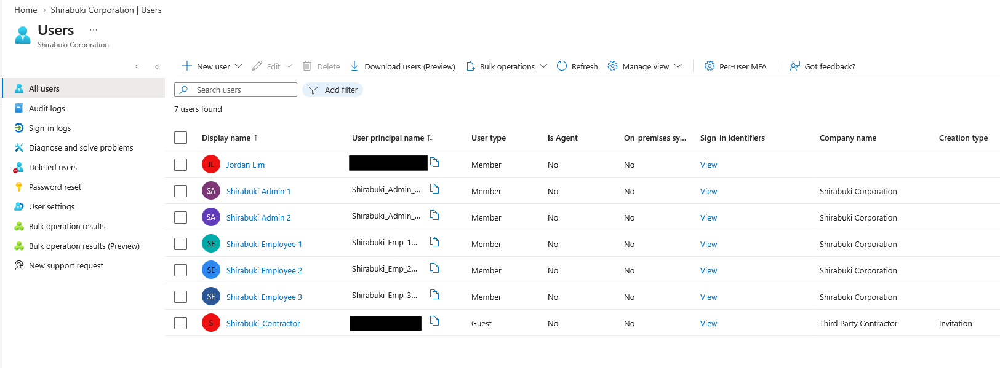

- Groups List 
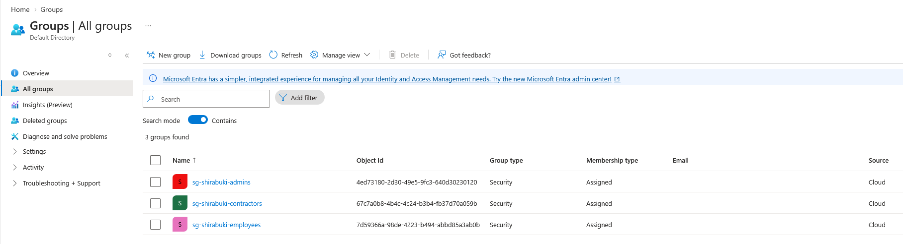

- Group Owners
   - Admin Owners 
   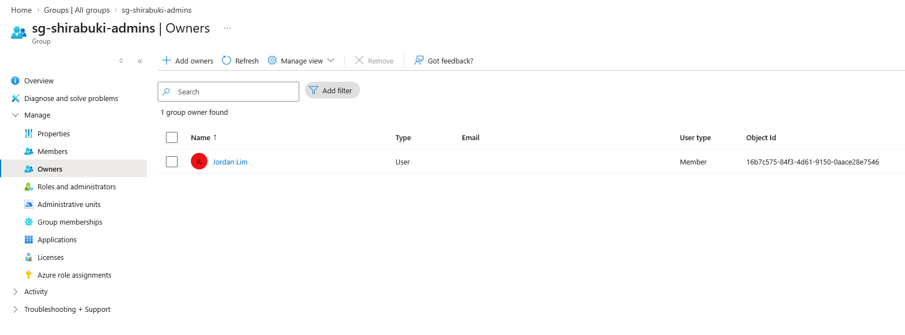
   - Employee Owners 
   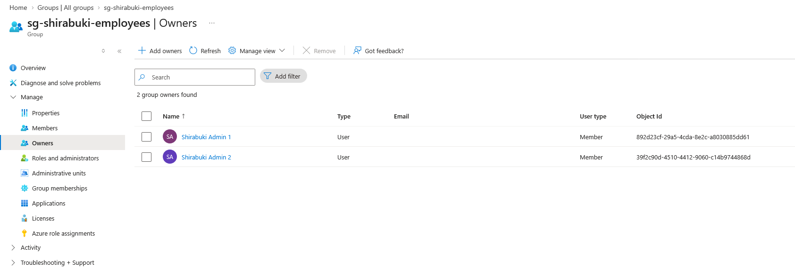
   - Contractor Owners 
   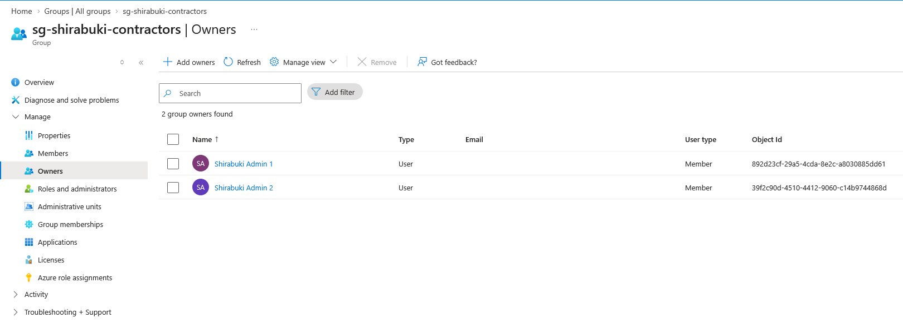

- Group Members
   - Admin Members 
   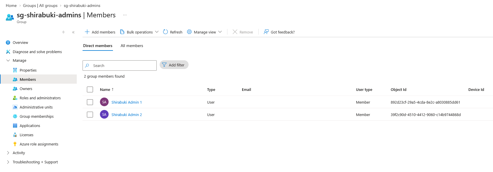
   - Employee Members 
   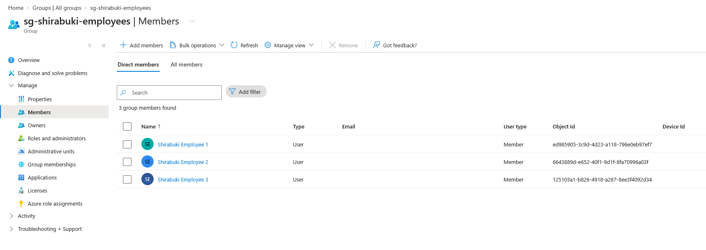
   - Contractor Members 
   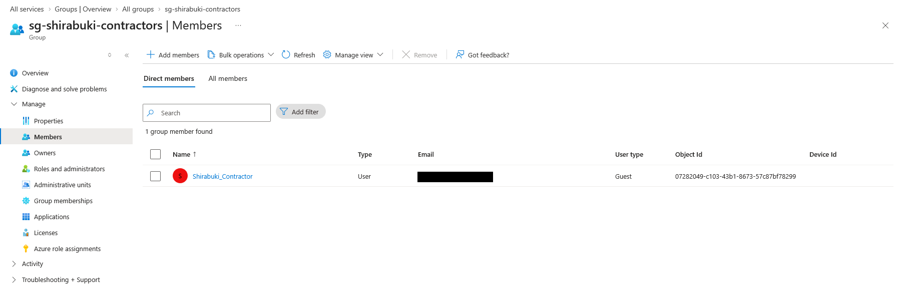

- Inital Password Reset Requirement (Shirabuki Employee 1)
   - Going through flow to see if "Auto-generate password" was enabled by default 
   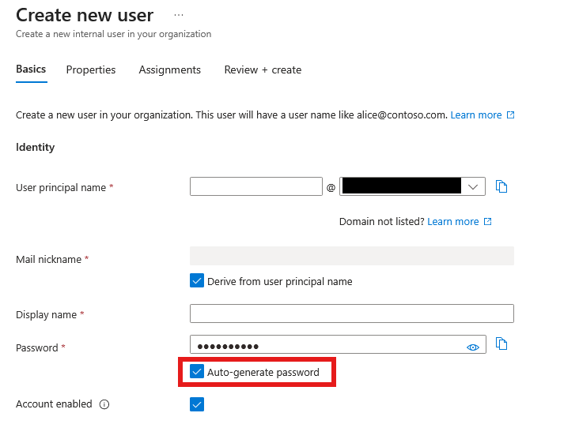
   - Password Reset Requirement in Azure Portal 
   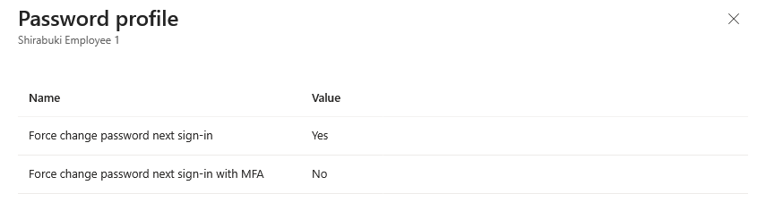
   - Password Reset Requirement during sign in 
   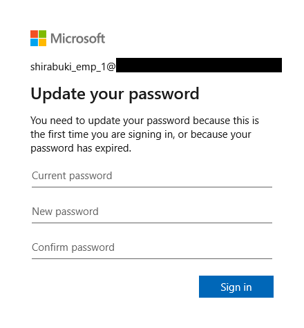