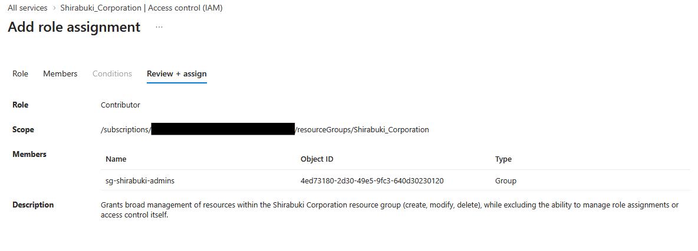
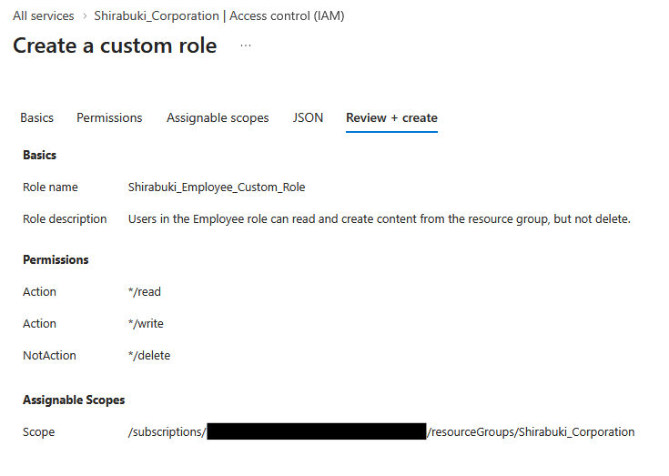
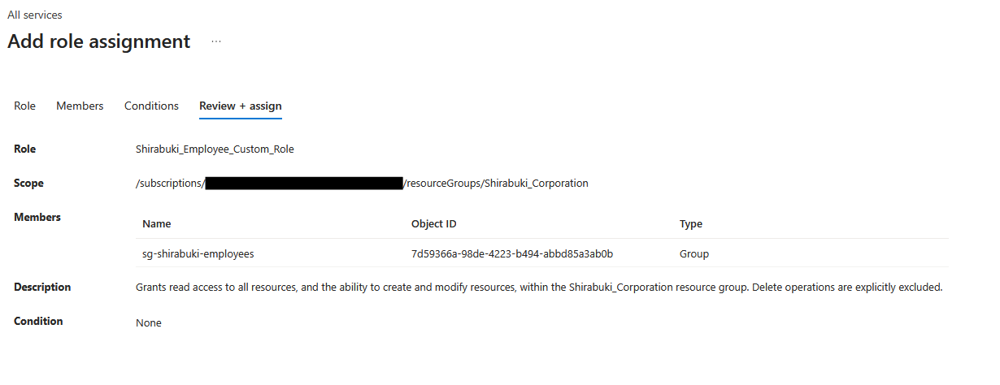
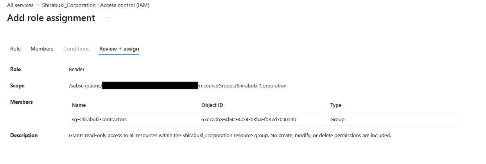
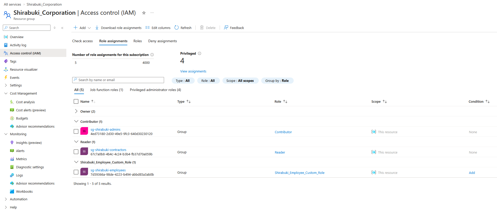

## Summary
After building out the users and groups, I designed a tiered role structure. Administrators in this resource group had a broad, but access-limited role, employees were given a custom read/write role, and contractors were given a read-only access role. With this portion of the project, I wanted to create roles that would mimic production environments that I had seen in enterprise environments.

## The Problem
Shirabuki Corporation needs a form of access-control for their users and groups. Groups and users exist, but have no permissions assigned or granted yet. Broadly speaking, the administrators should be able to manage most of the resource group, the employees should be able to work without being able to delete items in the RG, and contractors should only have visibility privileges.

## What Was Built
- Roles for each group of users
   - Administrators: Contributor (Built-in), and assigned to "sg-shirabuki-admins"
   - Employee Role: Custom Role (Shirabuki_Employee_Custom_Role), and assigned to "sg-shirabuki-employees"
      - See the [EmployeeCustomRoleDefinition.json](EmployeeCustomRoleDefinition.json) file for more detail.
   - Contractors: Reader (Built-in), and assigned to "sg-shirabuki-contractors"

## Decisions Made
   -  Decisions
      - Administrator Decisions
         - Administrators were not granted owner permissions as they should not have the authority to have full access to other environments beyond their team scope.
         - While assigning the Administrator role, I noticed that Azure's role picker separated "Job Function Roles" and "Privileged Administrator Roles." Contributor is categorized as the latter.
         - In this project, the Admin persona's "Contributor" role is scoped narrowly to the Shirabuki Corporation resource group, mirroring how a team lead or platform engineer might hold broad control over their own team's environment,not unrestricted authority across an organization. In a real enterprise, granting even this scoped "Contributor" role would typically go through a dedicated IAM/platform team and a formal request process, rather than being self-assigned or freely available. This project's root tenant account acts as a stand-in for that centralized authority.
      - Employee Decisions
         - Decided on creating a custom role to specifically allow reading and managing the resource group, but without the deletion functionality, as an employee should not have the higher privilege of deleting information in the resource group unless explicitly agreed upon though reporting and change management procedures.
         - I noted that due to the wildcard Read and Write functionality, the employee custom role was elevated to privileged administrator roles. Based on Microsoft's own documentation, this classification is based on scope of granted permissions. Broad write access, specifically, automatically placed this custom role within the privileged administartor role, and warrants careful consideration for such powerful permissions.
         - The current Employee role uses a wildcard write grant (*/write) rather than scoping to specific resource types. This was a direct consequence of keeping this lab resource-free.Without an actual resource type (e.g., blob storage, a database) to scope against, a wildcard was the only way to give the role meaningful write access at all. In hindsight, this completely undermines the concept of least privilege: the role grants write access to anything that could exist in the resource group, not the minimum access an employee's actual job would require. A production implementation would scope this role to specific resource types and actions (e.g., Microsoft.Storage/storageAccounts/blobServices/containers/write) rather than a wildcard, so the role's permissions map to an actual job function instead of a hypothetical one.
      - Contractor Decisions
         - Initially looked to create a custom role, but realized that there was an in-built "Reader" role that fit my needs.

## Screenshots
- Creating Role Assignment for "sg-shirabuki-admins"

- Creating Custom Role for "sg-shirabuki-employees"

- Creating Role Assignment for "sg-shirabuki-employees"

- Creating Role Assignment for "sg-shirabuki-contractors"

- List of Role Assignments
