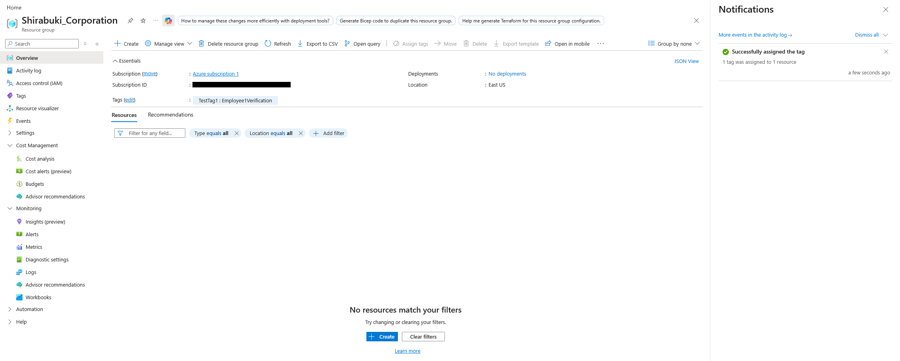
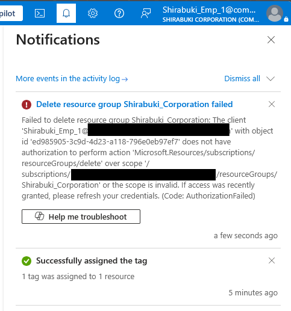
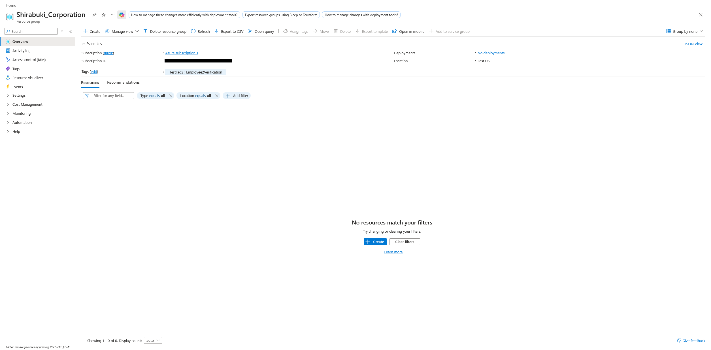
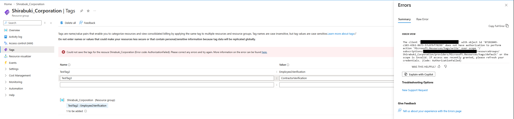

## Summary
Now that users, roles, and basic access controls have been established, I wanted to test and verify that my access controls were working as I had created them in the RBAC Roles phase.

## The Problem
Shirabuki Corporation has defined and created role-based permissions for Administrators, Employees, and Contractors. While this is a step in the right direction, the company wants to have the permissions tested by an authenticated user before being rolled out to employees and contractors in production. While a majority of users would interact with their accounts through a web portal, verification will also be performed via Azure CLI to ensure that verification happens regardless of the method of entry. Testing both methods rules out the possibility that a restriction is an enforced access boundary, rather than a UI convenience, like a greyed out button.

## What Was Built
- This phase of the project leans more towards the testing of RBAC functionality within both the user portal and Azure CLI to visualize the enforcement mechanism in two different ways.
- With Employee 1, I operated the user under the assumption that they would primarily access their account through the Azure web portal.
- With Employee 2, I operated the user under the assumption that they would interface with Azure CLI.
- With the contractor, I operated the user under the assumption that they would interface with the Azure web portal.

## Decisions Made
   -  Decisions
      - Since I had multiple users to test functionality, I decided to demonstrate the access controls by using the follow methodology:
         - Employee 1: Screenshots to see how the user would see access controls from Azure Web Portal.
            - Test cases:
               - Tag the resource group with a "TestTag1: Employee1Verification" tag. (Expected Success)
               - Delete the entire resource group via delete button. (Expected Deny)
         - Employee 2: Azure CLI to show the same enforcement mechanisms, but in a programmatic approach.
            - Test Cases:
               - Tag the resource group with a "TestTag2: Employee2Verification" tag. (Expected Success)
               - Delete the entire resource group via the Azure CLI. (Expected Deny)
            - See [AzureCommands_EMP.md](AzureCommands_EMP.md) for the scripts that were run.
         - Contractor: Screenshots to see read and blocked write functionality in Azure web portal.
            - Test Cases:
               - View the Resource Group properties as a Contractor (Expected Success)
               - Tag the resource group with TestTag3: ContractorVerification (Expected Deny)
         - Notably, while trying to set up and test the contractor persona, I discovered that signing into `https://portal.azure.com`, the contractor has to sign in through a tenant specific URL. Thus, I had to use `https://portal.azure.com/<tenantname>.onmicrosoft.com` to access Azure resources.

## Screenshots
- Employee 1 - Tagging Success 

- Employee 1 - Resource Group Deletion Fail 

- Contractor - View/Read Success 

- Contractor - Tagging Fail 
