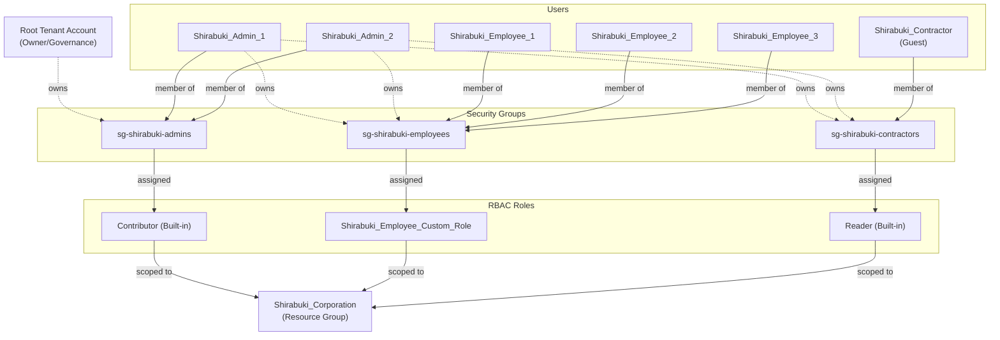

# Azure IAM Least Privilege Lab

Demonstrating least-privilege IAM design in Microsoft Azure's EntraID using free-tier RBAC and Security Defaults.

Initally dated: 06 August 2026

Most recent update: 26 August 2026

## Project Overview
This project is designed to leverage free Azure resources to understand and practice IAM principles for a fictionalized organization called Shirabuki Corporation. The primary goal of this project is to build a practical, demonstrable experience  with enterprise access control patterns before applying them in a production environment. Shirabuki Corp. has two admins, three employees, and one contractor.

## Objectives
- Apply least-privilege principles using Azure RBAC
- Use security groups to manage access
- Create and assign a custom RBAC role
- Enforce baseline identity protections
- Verify that permissions behave as intended
- Evaluate the implementation from a GRC perspective

## Skills Demonstrated
- Least privilege access design
- Custom RBAC roles
- Group-based access assignment
- Security baseline configurations
- Infrastructure documented as code
- Security Defaults
- MFA enforcement

## Tech Stack/Tools Used
- Microsoft Entra ID (free tier)
- Azure RBAC
- Azure CLI
- PowerShell
- Markdown
- Claude AI/LLM

## AI Note:
This project's design decisions, Azure configuration, and testing were performed independently. Claude (Anthropic) was used as a support tool for structuring documentation, troubleshooting technical issues, and editorial review of written content.

## Project Structure
```
Azure_IAM_Least_Privilege_Lab/
├── README.md
├── LICENSE
├── 01.Users_and_Groups/
│   ├── README.md
│   └── Screenshots/
├── 02.RBAC_Roles/
│   ├── README.md
│   ├── EmployeeCustomRoleDefinition.json
│   └── Screenshots/
├── 03.Access_Verification/
│   ├── README.md
│   ├── AzureCommands_EMP.md
│   └── Screenshots/
├── 04.Mini_Audit_GRC         (in progress)
│   ├── README.md
│   └── Screenshots/
```

## Scenarios and Table of Contents
| Scenario | Description | Status |
|---|---|---|
| [01 - Users and Groups](./01.Users_and_Groups/README.md) | Personas, security groups, default configurations, and ownership/governance decisions for Shirabuki Corp | ✅ Complete |
| [02 - RBAC Roles](./02.RBAC_Roles/README.md) | Custom least-privilege roles assigned to groups | ✅ Complete |
| [03 - Access Verification](./03.Access_Verification/README.md) | Proof of role access enforcement | ✅ Complete |
| [04 - Mini Audit GRC](./04.Mini_Audit_GRC/README.md) | Assessing the project through the lens of a Governance, Risk, and Compliance audit | 🔧 In Progress |

## Architecture Overview


## Prerequisites
This project was built using only Microsoft Azure's free tier plan. To reproduce this project, the only things needed are:
- Microsoft Account
- Azure free tier tenant
- Time and patience

## License Note
This project uses the MIT license.
